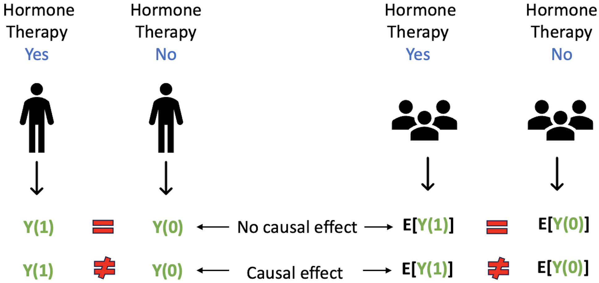
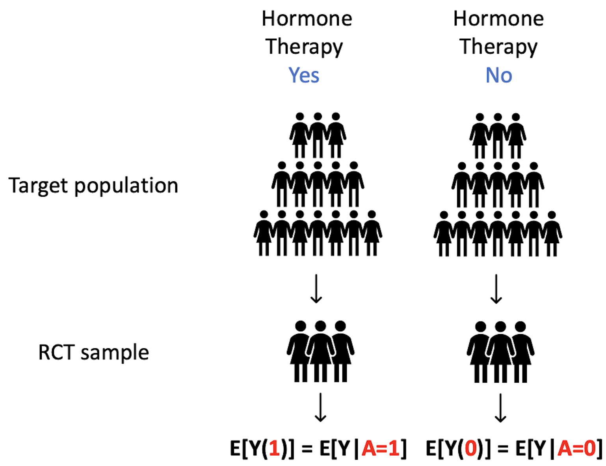
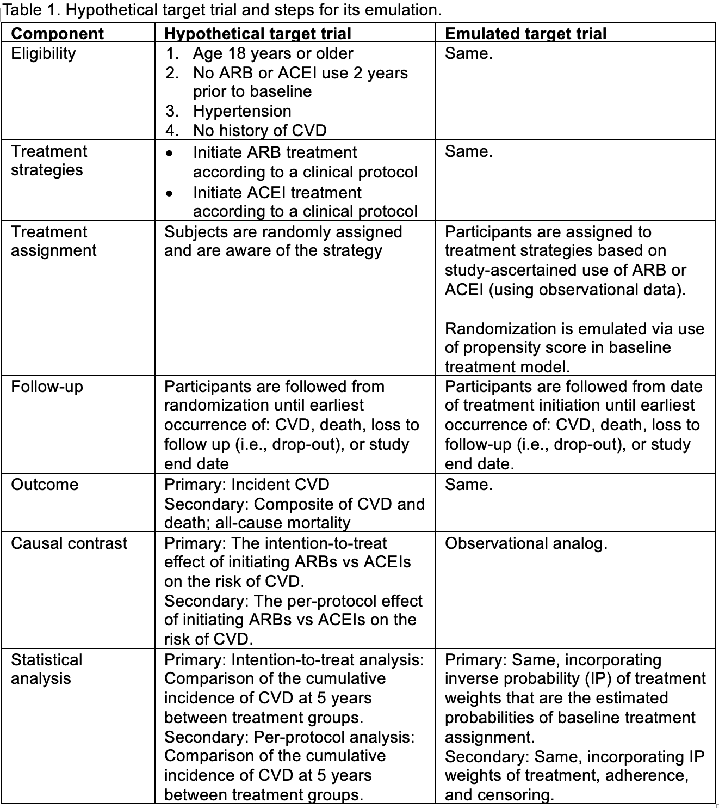

```{r, echo = FALSE, message = FALSE}
knitr::opts_chunk$set(
  collapse = TRUE,
  comment = "#>"
)
options(warn = -1) 
```

```{r, message = FALSE, warning = FALSE}
# Load packages
library(TrialEmulation)
library(dplyr)
library(tidyr)
library(ggplot2)
library(survival)
library(survminer)
library(lubridate)
library(cobalt)
library(kableExtra)

working_dir <- getwd()
knitr::opts_knit$set(root.dir = working_dir)

# Set seed for reproducibility
set.seed(412)
```

# Introduction

The **intention-to-treat (ITT)** analysis estimates the effects of initiating one treatment versus another on an outcome of interest regardless of the subsequent adherence to the assigned treatment.
In contrast, the **per-protocol (PP)** analysis estimates the effects of *initiating and continuously adhering to the initial treatment*, which is discussed in the [Per-protocol Analysis tutorial](https://uqualitycausal.github.io/TTECausalR/PerProtocol.html).

## Modern causal inference

Counterfactual framework is the foundation of modern causal inference and it defines causal effects as the contrast in potential outcomes.
Let us use the research question from @Hernn2016 as an example:

-   What is the effect of hormone therapy on the 5-year risk of breast cancer among postmenopausal women?

-   Note that this is a causal question rather than an associational question since we are interested in contrasting the outcomes under two hypothetical scenarios.

-   At the individual level, the potential outcomes $Y(1)$ and $Y(0)$ under two treatments are the outcomes that would be observed if the subject had taken hormone therapy and had never taken the hormone therapy, respectively.
    The contrast in the potential outcomes, either on the absolute difference scale or relative scale, is referred to as **individual causal effect** (ITE).

-   In comparison, at the population level, the potential mean outcomes $E[Y(1)]$ and $E[Y(0)]$ under two treatments are the average of the outcomes that would be observed if all subjects had taken hormone therapy and had never taken the hormone therapy, respectively.
    The contrast in these potential outcomes is referred to as **average causal effect** (ATE).

-   For both ITE and ATE, if the potential outcomes under the two treatments are the same, then there is no causal effect; otherwise, this is a causal effect.

    {width="75%"}

## The fundamental problem of counterfactual framework

For an individual, we can only observe the outcome under one scenario, either under hormone therapy or no hormone therapy, **but not both**.
Although this is an obstacle at the individual level, we can resolve this barrier at the population level:

-   Consider an ideal randomized control trial (RCT) where patients are perfectly randomized to hormone therapy versus usual care treatment.

-   Under this set up, it is reasonable to say that patients from either treatment group can represent all the patients in the study since there is no difference in patient characteristics between treatment groups, thanks to randomization.

-   Given this, the mean outcome in the hormone therapy group equals to the potential outcome had everyone in the study taken hormone therapy.
    Similarly, the mean outcome in the usual care group equals to the potential outcome had everyone in the study taken usual care.

    {width="60%"}

-   Thus, we can observe both potential outcomes at the population level under an RCT design and estimate causal effects.
    This is a main reason why RCT is the gold standard for comparative effectiveness research (CER).

## From randomized control trials to observational studies

Many researchers think observational data is messy and a more challenging place to find reliable evidence, so let us summarize the advantages and disadvantages of RCTs and observational studies on a list of key considerations of a study below:

|   | Randomized Control Trial | Observational Study |
|:-----------------------|:----------------------:|:----------------------:|
| Time Zero | Clear and straightforward: Randomization | Not straightforward |
| Selection Bias | Some is prevented, e.g., prevalent user bias | Exist if eligibility, treatment initiation, and start of follow up are misaligned |
| Immortal-time bias | No | Yes if eligibility, treatment initiation, and start of follow up are misaligned |
| Confounding Bias | No | Yes |
| Missing Data | Less | More |
| Measurement Error | Less | More |
| Statistical Power | Limited | Rich |
| Patient Information | Limited | Rich |
| Generalizability | Limited | More generalizable |
| Cost | Millions of dollars | Existing data |
| Follow-up Time | Limited: 0.5-5 years | Long-term: 10-20 years |
| Ethical Concerns | More | Much Less |

According to the summary above, I argue that high-quality observational studies can complement findings from RCTs and provide actionable evidence when conducted robustly.
Here are the reasons:

-   We explained in our [previous tutorials](https://uqualitycausal.github.io/TTECausalR/TTEdemoSig.html) that by emulating a target trial, either an existing or hypothetical trial, we are able to clearly define time zero of the study and align patient eligibility, treatment initiation, and start of follow up, leading to minimized selection bias and immortal time bias.
-   We have established data cleaning pipelines and statistical methods to handle missing data and measurement error.
-   Large-scale electronic health records (EHRs), as one of the main resources of observational data, provides much richer power than RCTs.
-   RCTs are typically powered for primary estimand, e.g., average treatment effects, so studying treatment effect heterogeneity using RCT data is challenging. This is where observational data can complement.
-   EHR data captures rich patient information on demographics, disease history, lab results, comorbidities, and so on.
-   EHR captures a much wider study population, from patients with minor health issues to patients in severe disease conditions, while RCTs often have strict eligibility criteria and exclude patients who are too sick.
-   RCTs cost several millions of dollars to run while EHR data already exists.
-   Primarily due to the high cost of RCTs, participants are often followed up for a limited time, while EHR data includes patient's records for decades.
-   In many situations, RCTs are not feasible due to ethical concerns, while EHR data captures a wide range of exposures and health events that occur naturally over a patient’s life course.
-   @Wang2023 carefully emulated 32 RCTs using observational data.
    -   Overall observed agreement between the RCT and the database emulation results was a Pearson correlation of 0.82 (95%CI, 0.64-0.91), with 75% meeting statistical significance, 66% estimate agreement, and 75% standardized difference agreement.

## Conduct high-quality observational studies

To leverage observational data for estimating causal treatment effects, we need to make the following **identifiability assumptions**:

-   Stable Unit Treatment Value Assumption (SUTVA)
    -   Treatment variation irrelevance and no interference, i.e., $Y_i(a_1, m_1, ..., a_n, m_n) = Y_i(a_i)$.
    -   One individual’s outcomes $Y_i$ are not affected by others' treatment assignment $a_j$ and the mode treatment is delivered $m_j$, with $j \neq i$.
-   Consistency
    -   The potential outcome under the actual treatment is the same as the observed outcome, i.e., $Y_i(a_i) = Y_i$ if $A_i = a_i$.
-   Positivity
    -   There are individuals in the treatment and control arms for every covariate space that exists in the study population, i.e., $0<\pi<1$, where $\pi$ is the probability of receiving the treatment.
-   **Conditional Exchangeability**
    -   Treatment and potential outcomes are independent conditional on measured confounders $X$, under the assumption that all variables affecting both treatment assignment and outcome are included in $X$, i.e., $A \perp \{Y(1), Y(0)\}|X$.
    -   Patients are exchangeable in each stratum defined by $X$.
    -   Failing to satisfy conditional exchangeability is commonly referred to as *confounding by indication* or *endogeneity*.

## Causal inference methods for restoring conditional exchangeability

Various propensity score methods, including matching, weighting, stratification, regression, doubly robust methods [@VanDerLaan2006, @Wager2018], marginal structural models, are widely used to estimate ATEs and are well explained by @Hernan2020.
We focus on the **inverse probability (IP) of treatment weighting** approach [@Horvitz1952] here and defer other methods to future tutorials:

-   Propensity score (PS) is defined as the probability of assigning the treatment given covariates, i.e., $\pi = P(A=1|X)$.
-   The main idea is using the PSs to weigh the observed outcomes for each treatment group.
-   IP weights: $\frac{1}{\pi}$ for treated units and $\frac{1}{1-\pi}$ for control units.
-   The output of this weighting process is a pseudo-population where treatment assignment is random given $X=x$.
-   Within this pseudo-population, we estimate the ATE as $\hat{\tau}_{\mathrm{ATE}} = \frac{1}{N}\sum_i^N \left(\frac{Y_iA_i}{\pi_i}-\frac{Y_i (1-A_i)}{1-\pi_i}\right)$.

## Implementation of intention-to-treat analysis

Recall our previous example that aims to compare the effectiveness of ARB versus ACEI anti-hypertensive medications on reducing the risk of cardiovascular disease (CVD).

{width="95%"}

We emulated the target trial specified in **Table 1** and prepared the dataset in the [single-trial emulation session](https://uqualitycausal.github.io/TTECausalR/TTEdemoSig.html).
Thus, we directly load the pre-processed data.

```{r}
obsdata5 <- readRDS("obsdata5.rds")

get_label <- function(x) {
  lbl <- attr(x, "label", exact = TRUE)
  if (is.null(lbl)) "" else as.character(lbl)
}

dict <- data.frame(
  Variable = names(obsdata5),
  Meaning  = vapply(obsdata5, get_label, character(1)),
  check.names = FALSE
)

knitr::kable(dict, caption = "Data Dictionary", row.names = FALSE)
```

We now convert the long format data (multiple rows per subject) to wide format (one row per subject), retaining baseline covariates, treatment variable, follow-up time, and outcome status.

```{r}
# Find event/censoring time (min time of the two) for subjects who experience it 
# Find follow-up time (max time) for subjects who never experience event/censoring 
obsdata6 <- obsdata5 %>%
  group_by(id) %>%
  summarise(
    event_or_cens = any(Y == 1 | C == 1, na.rm = TRUE),
    follow_up = ifelse(event_or_cens,
                       min(follow_up[Y == 1 | C == 1], na.rm = TRUE),
                       max(follow_up, na.rm = TRUE)),
    outcome = ifelse(any(Y == 1 & C == 0, na.rm = TRUE), 1, 0), 
    .groups = "drop") %>%
  left_join(obsdata5, by = c("id", "follow_up")) %>%
  select(id, assigned_treatment, X1_0, X2_0, X3, X4, age_0, follow_up, outcome) %>% 
  arrange(id)

# Check if all subjects are included
setequal(unique(obsdata5$id), unique(obsdata6$id))
```

In a time-to-event outcome analysis, the censoring mechanism for individuals who dropped out early plays an important role in deciding the appropriate statistical analysis.
We consider the two scenarios below:

-   **Non-informative Censoring**: Early dropout is completely at random.
-   **Informative Censoring**: Early dropout is at random conditional on patients' pre- and post-treatment characteristics.

Below, we demonstrate the analysis procedures step-by-step for each scenario.

### Scenario 1: Non-informative Censoring

-   **Step 1**: Estimate the propensity scores, i.e., the probabilities of initiating ARB, using logistic regression with baseline covariates as predictors. Compute unstabilized IP of treatment weights according to the IP weights formula above.
-   Machine learning (ML) models are alternatives, e.g., gradient boosting machine, adaptive lasso; however, [doubly robust methods](https://uqualitycausal.github.io/TTECausalR/DR.html) should be used when PS is estimated using ML models [@Chernozhukov2018].

```{r}
# Fit a logistic regression
ps_model <- glm(assigned_treatment ~ X1_0 + X2_0 + X3 + X4 + age_0, 
                 data = obsdata6, 
                 family = binomial)

# Calculate propensity scores
p <- predict(ps_model, type = "response")

# Calculate inverse probability of treatment weights (IPTW)
obsdata6 <- obsdata6 %>%
  mutate(
    p = p,
    trt_weight = if_else(
      assigned_treatment == 1, 
      1/p, # 1/P(treatment) for treated subjects
      1/(1-p) # 1/(1-P(treatment)) for control subjects
  ))
```

-   **Step 2**: Examine overlap of treatment by visualizing the distributions of propensity score between two treatment groups.

```{r fig.width=5, fig.height=3}
# Visualize overlap
ps_plot <- obsdata6 %>%
  mutate(treatment_group = factor(assigned_treatment, 
                                  levels = c(0, 1), 
                                  labels = c("Trt_0", "Trt_1"))) %>%
  ggplot(aes(x = p, fill = treatment_group, group = treatment_group)) +
  theme_classic() +
  geom_density(data = . %>% filter(treatment_group == "Trt_1"),
               aes(y = after_stat(density)), alpha = 0.6) +
  geom_density(data = . %>% filter(treatment_group == "Trt_0"), 
               aes(y = -after_stat(density)), alpha = 0.6) +
  xlab("Propensity Score") +
  ylab("Density") +
  labs(fill = "Treatment Group",
       title = "Distribution of Propensity Scores") +
  theme(plot.title = element_text(size = 10, face = "bold"))

print(ps_plot)
```

-   **Step 3**: IP weighting approach is unstable when there exists extreme weights, so we truncate the weights above 99th percentile to improve stability.

```{r}
# Save untruncated weights for later use
obsdata6 <- obsdata6 %>%
  mutate(trt_weight_untrunc = trt_weight)

summary(obsdata6$trt_weight)

trt_weight_cutoff <- quantile(obsdata6$trt_weight, 0.98)
obsdata6 <- obsdata6 %>%
  mutate(trt_weight = ifelse(trt_weight > trt_weight_cutoff, trt_weight_cutoff, trt_weight))

saveRDS(obsdata6, "obsdata6.rds")
```

-   **Step 4**: Evaluate covariate balance using the absolute standardized mean difference (ASMD) metric and a threshold of 0.1 is used to determine an acceptable balance.

```{r fig.width=6, fig.height=4}
bal <- bal.tab(assigned_treatment ~ X1_0 + X2_0 + X3 + X4 + age_0, 
        data = obsdata6, estimand = "ATE", un = TRUE, # Include unadjusted balance
        weights = obsdata6$trt_weight,
        disp.means = TRUE, disp.sds = TRUE)

love.plot(bal, var.order = "unadjusted", abs = TRUE, thresholds = c(m = 0.1),
          stats = "mean.diffs", sample.names = c("Unweighted", "Weighted"),
          title = "Covariate Balance Before and After Weighting", 
          stars = "raw",
          var.names = c(X1_0 = "anti-HTN meds_0", 
                       X2_0 = "SBP_0", 
                       X3 = "Sex", 
                       X4 = "DBP",
                       age_0 = "Age_0")) +
  theme(plot.title = element_text(size = 10), plot.caption = element_text(hjust = 0, size = 8)) +
  labs(caption = "Abbreviations: anti-HTN meds_0 = antihypertensive medication use at baseline;
       \nSBP_0 = Standardized systolic blood pressure at baseline;
       \nDBP = Standardized diastolic blood pressure at baseline")
```

-   **Step 5**: Fit an IP weighted Cox Proportional Hazards (CPH) model.

```{r fig.width=5, fig.height=3}
# Fit weighted CPH model
weighted_cox_model <- coxph(Surv(follow_up, outcome) ~ assigned_treatment, 
                             data = obsdata6, weights = trt_weight)
summary(weighted_cox_model)

##### Interpretation:
# Hazard ratio (HR) = exp(coef)
# coef < 0 & HR < 1: treatment is associated with lower risk.
# coef > 0 & HR > 1: treatment is associated with higher risk.
# P-value <= alpha = 0.05 & 95% confidence interval excluding 1 suggest a statistically significant effect (not in this case).
```
The hazard ratio (HR) is the estimand.

-   **Step 6**: Conduct visual checks for proportional hazard (PH) assumption in the Cox model.

```{r fig.width=5, fig.height=3}
# Schoenfeld Residuals plot: A flat line indicates that the proportional hazards assumption holds.
plot(cox.zph(weighted_cox_model))
```

```{r fig.width=5, fig.height=3}
# Log-log plot: Parallel lines indicate proportional hazards assumption is met.
obsdata6_nonzero <- obsdata6 %>% filter(follow_up > 0)
surv_fit <- survfit(Surv(follow_up, outcome) ~ assigned_treatment, data = obsdata6_nonzero)
ggsurvplot(surv_fit, data = obsdata6_nonzero, fun = "cloglog", 
           title = "Log-log Plot", xlab = "log(Time)",
           legend.title = "Treatment Group", 
           legend.labs = c("Trt_0", "Trt_1"),
           ggtheme = theme(legend.text = element_text(size = 9),      
              legend.title = element_text(size = 10)))
```

### Scenario 2: Informative Censoring

We directly work with the long format data in this scenario since we need to explicitly model the censoring mechanism.

-   **Step 1**: Estimate propensity scores. We skip this step as it is the same as in Scenario 1.
-   **Step 2**: Estimate censoring probabilities and censoring weights at each follow-up time using logistic regression.

```{r}
# Create lagged covariates
obsdata5 <- obsdata5 %>%
  arrange(id, follow_up) %>%
  group_by(id) %>%
  mutate(
    X1_lag = lag(X1),
    X2_lag = lag(X2),
    A_lag = lag(A)) %>%
  ungroup()

obsdata5$A_lag <- as.factor(ifelse(is.na(obsdata5$A_lag), -1, obsdata5$A_lag))
```

```{r}
# Fit logistic regression to predict censoring based on treatment and covariates
# Skip baseline observations since baseline censoring weight is always 1
# Note C=1: censored, but we want to know the probability of not being censored
obsdata5 <- obsdata5 %>% mutate(C_neg = 1-C)

censor_model <- glm(C_neg ~ A_lag + X1_lag + X2_lag + X3 + X4 + age_0, 
                    data = obsdata5 %>% filter(follow_up > 0), family = binomial)

obsdata5 <- obsdata5 %>%
  mutate(
    censor_probs = if_else(
      follow_up == 0, 1, # Baseline should be 1
      predict(censor_model, newdata = ., type = "response")), # Calculate censoring probabilities
    
    censor_weight = if_else(
      follow_up == 0, 1, # Baseline should be 1
      ifelse(C_neg == 1, # Calculate censoring weights (unstabilized)
             1 / censor_probs, # Uncensored
             1 / (1 - censor_probs)) # Censored
    )
  )
```

-   **Step 3**: Compute cumulative censoring weights up to current time.

```{r}
obsdata5 <- obsdata5 %>%
  arrange(id, follow_up) %>%
  group_by(id) %>%
  mutate(cum_censor_weight = cumprod(censor_weight)) %>% 
  ungroup()

# Calculate summary statistics for cumulative censoring weights by treatment group
censor_weight_summary <- obsdata5 %>%
  mutate(treatment_group = factor(assigned_treatment, 
                                  levels = c(0, 1), 
                                  labels = c("Trt_0", "Trt_1"))) %>%
  group_by(treatment_group) %>%
  summarise(
    min = min(cum_censor_weight, na.rm = TRUE),
    max = max(cum_censor_weight, na.rm = TRUE),
    mean = mean(cum_censor_weight, na.rm = TRUE),
    sd = sd(cum_censor_weight, na.rm = TRUE),
    .groups = 'drop')%>%
  mutate(across(c(min, max, mean, sd), ~ round(.x, 2)))

print(censor_weight_summary)
```

-   **Step 4**: Combine censoring weights with baseline treatment weights. The censoring weights are used to adjust for the selection bias induced by informative censoring.

```{r}
# Combined weight
obsdata5 <- obsdata5 %>%
  left_join(obsdata6 %>% select(id, trt_weight_untrunc), by = "id") %>%
  mutate(combi_weight = trt_weight_untrunc * cum_censor_weight) 
```

-   **Step 5**: Truncate the final, combined weights at 98th percentile.

```{r}
summary(obsdata5$combi_weight)
comb_weight_cutoff <- quantile(obsdata5$combi_weight, 0.98, na.rm = TRUE)

obsdata5 <- obsdata5 %>%
  mutate(combi_weight = ifelse(combi_weight > comb_weight_cutoff, comb_weight_cutoff, combi_weight))
summary(obsdata5$combi_weight)
```

-   **Step 6**: Fit a weighted pooled logistic regression to estimate the hazard of CVD at each follow-up time.

```{r}
# Fit weighted pooled logistic regression (start from baseline time)
# Do not need to add other covariates as predictors for the unstablized weights case

data_filtered <- obsdata5 %>% filter(C != 1) # Exclude censored observations (C=1) because their outcomes are unknown
data_filtered$combi_weight <- as.numeric(data_filtered$combi_weight)

weighted_iptw_ipcw_model <- glm(Y ~ assigned_treatment * follow_up + I(follow_up^2), 
                                data = data_filtered, 
                                weights = combi_weight, 
                                family = binomial)

summary(weighted_iptw_ipcw_model)
```

-   **Step 7**: Create two counterfactual datasets such that all individuals are assigned to two treatment groups.

```{r}
gen_cf_data <- function(data, trt) {
  data_cf <- data %>% mutate(assigned_treatment = trt)
  return(data_cf)
}

data_all_trt_1 <- gen_cf_data(obsdata5 %>% filter(C != 1), 1)
data_all_trt_0 <- gen_cf_data(obsdata5 %>% filter(C != 1), 0)
```

-   **Step 8**: Calculate cumulative incidences for each treatment group at specific time points.

```{r}
# Calculate conditional cumulative incidences (combined weights)
calc_condit_cum_inc <- function(outcome_model, data) {
  
  pred_data <- data %>% select(id, follow_up, assigned_treatment)

  # Predict probabilities
  pred_data$prob_outcome <- predict(outcome_model, newdata = pred_data, type = "response") 
  
  # Calculate cumulative incidence for each subject
  cum_inc <- pred_data %>%
    arrange(id, follow_up) %>%
    group_by(id) %>%
    mutate(
      surv_prob = cumprod(1 - prob_outcome), # P(alive up to current time)
      surv_prob_lag = lag(surv_prob, default = 1), # P(alive up to last time)
      death_prob = surv_prob_lag * prob_outcome, # P(dead at current time)
      cum_inc = cumsum(death_prob) 
    ) %>% ungroup()
  
  return(cum_inc)
}

condit_cum_inc_risk_1 <- calc_condit_cum_inc(weighted_iptw_ipcw_model, data_all_trt_1)
condit_cum_inc_risk_0 <- calc_condit_cum_inc(weighted_iptw_ipcw_model, data_all_trt_0)
```

-   **Step 9**: Calculate marginal cumulative incidences: Average conditional cumulative incidence at each visit across all individuals in two datasets.

```{r}
marg_res <- bind_rows(
  condit_cum_inc_risk_1 %>% 
    group_by(follow_up) %>%
    summarise(mean_cum_inc = mean(cum_inc, na.rm = TRUE), .groups = 'drop') %>%
    mutate(risk = "risk_1"),
  
  condit_cum_inc_risk_0 %>% 
    group_by(follow_up) %>%
    summarise(mean_cum_inc = mean(cum_inc, na.rm = TRUE), .groups = 'drop') %>%
    mutate(risk = "risk_0")
)
```

-   **Step 10**: Compute risk differences and risk ratios between treatment groups.

```{r}
# Calculate incidence differences and ratios
inc_comp <- marg_res %>%
  select(follow_up, risk, mean_cum_inc) %>%
  pivot_wider(names_from = risk, values_from = mean_cum_inc) %>%
  mutate(risk_diff = risk_1 - risk_0, risk_ratio = risk_1 / risk_0)
```

-   **Step 11**: Display risk differences and risk ratios at times of interest.

```{r}
# Marginal cumulative incidences at different time points
key_times <- c(182, 365) # Days corresponding to 6 months and 1 year

# Find the closest time points in the data stratified by risk group
cum_inc_at_keys <- marg_res %>%
  crossing(assess_time = key_times) %>%
  filter(follow_up >= assess_time) %>%
  group_by(risk, assess_time) %>%
  slice_min(follow_up, n = 1, with_ties = FALSE) %>%
  ungroup() %>%
  select(risk, assess_time, mean_cum_inc) %>%
  arrange(risk, assess_time) %>%
  pivot_wider(names_from = risk, values_from = mean_cum_inc)
 
# Risk differences and ratios at different time points
risk_contrast_at_keys <- inc_comp %>%
  crossing(assess_time = key_times) %>%
  filter(follow_up >= assess_time) %>%
  group_by(assess_time) %>%
  slice_min(follow_up, n = 1, with_ties = FALSE) %>%
  select(assess_time, risk_1, risk_0, risk_diff, risk_ratio) %>%
  ungroup()

results_itt <- risk_contrast_at_keys %>% mutate(assess_time = as.integer(assess_time / 30), method = "ITT")
results_itt # 6 months and 12 months
```

-   **Step 12**: Fit an unadjusted pooled logistic regression model and compute results.

```{r}
# No weights
plr_model_unadj <- glm(Y ~ assigned_treatment * follow_up + I(follow_up^2), 
                       data = obsdata5 %>% filter(C != 1), 
                       family = binomial)

summary(plr_model_unadj)
```

```{r}
condit_cum_inc_treated_unadj <- calc_condit_cum_inc(plr_model_unadj, data_all_trt_1)
condit_cum_inc_untreated_unadj <- calc_condit_cum_inc(plr_model_unadj, data_all_trt_0)

marginal_res_unadj <- bind_rows(
  condit_cum_inc_treated_unadj %>% 
    group_by(follow_up) %>%
    summarise(mean_cum_inc = mean(cum_inc, na.rm = TRUE), .groups = 'drop') %>%
    mutate(risk = "risk_1"),
  
  condit_cum_inc_untreated_unadj %>% 
    group_by(follow_up) %>%
    summarise(mean_cum_inc = mean(cum_inc, na.rm = TRUE), .groups = 'drop') %>%
    mutate(risk = "risk_0")
)

# Calculate incidence differences and ratios
inc_comp_unadj <- marginal_res_unadj %>%
  select(follow_up, risk, mean_cum_inc) %>%
  pivot_wider(names_from = risk, values_from = mean_cum_inc) %>%
  mutate(risk_diff = risk_1 - risk_0, risk_ratio = risk_1 / risk_0)

# Marginal cumulative incidences at different time points
key_times <- c(182, 365) # 6 months and 1 year
cum_inc_at_keys_unadj <- marginal_res_unadj %>%
  tidyr::crossing(assess_time = key_times) %>%
  filter(follow_up >= assess_time) %>%
  group_by(risk, assess_time) %>%
  slice_min(follow_up, n = 1, with_ties = FALSE) %>%
  ungroup() %>%
  select(risk, assess_time, mean_cum_inc) %>%
  arrange(risk, assess_time) %>%
  pivot_wider(names_from = risk, values_from = mean_cum_inc)
cum_inc_at_keys_unadj

# Risk differences and ratios at different time points
risk_contrast_at_keys_unadj <- inc_comp_unadj %>%
  crossing(assess_time = key_times) %>%
  filter(follow_up >= assess_time) %>%
  group_by(assess_time) %>%
  slice_min(follow_up, n = 1, with_ties = FALSE) %>%
  select(assess_time, risk_1, risk_0, risk_diff, risk_ratio) %>%
  ungroup()

results_unadj <- risk_contrast_at_keys_unadj %>% mutate(assess_time = as.integer(assess_time / 30), method = "Unadjusted")
results_unadj
```

-   **Step 13**: Compare ITT, unadjusted, and truth results.

```{r}
truth <- readRDS("risk_truth.rds")
ITT_truth <- truth$ITT.truth
ITT_truth1 <- ITT_truth %>%
  filter(time %in% c(6, 12)) %>%
  rename(assess_time = time, risk_1 = cumulative_incidence_trt1, risk_0 = cumulative_incidence_trt0,
         risk_diff = risk_difference, risk_ratio = risk_ratio) %>% 
  mutate(method = "Truth")

all_results <- rbind(results_unadj, results_itt, ITT_truth1) %>%
  select(assess_time, method, risk_1, risk_0, risk_diff, risk_ratio) %>%
  pivot_wider(names_from = method, values_from = c(risk_1, risk_0, risk_diff, risk_ratio))

all_results %>%
  kable(col.names = c("Time (months)", rep(c("Unadjusted", "ITT", "Truth"), 4)), digits = 2, align = "c") %>%
  kable_styling(bootstrap_options = c("striped", "hover"), full_width = FALSE) %>%
  add_header_above(c(" " = 1, "Risk (Trt 1)" = 3, "Risk (Trt 0)" = 3, "Risk Diff" = 3, "Risk Ratio" = 3))
```

-   **Step 14**: Use weighted KM to calculate CI.

```{r}
# Scenario 1: non-informative censoring

km_weighted_s1 <- survfit(Surv(follow_up, outcome) ~ assigned_treatment,
                       data = obsdata6, weights = trt_weight)

km_summary_s1 <- summary(km_weighted_s1, times = key_times)

# CIF = 1 - S(t)
km_cif_s1 <- data.frame(assess_time = km_summary_s1$time, trt = km_summary_s1$strata, 
                        cum_inc = 1 - km_summary_s1$surv, 
                        ci_lower = 1 - km_summary_s1$upper, ci_upper = 1 - km_summary_s1$lower) %>%
  mutate(
    `Time (months)` = as.integer(assess_time / 30),
    trt = ifelse(grepl("=0", trt), "Trt 0", "Trt 1"),
    estimate = sprintf("%.2f (%.2f, %.2f)", cum_inc, ci_lower, ci_upper)
  ) %>%
  select(`Time (months)`, trt, estimate) %>%
  pivot_wider(names_from = trt, values_from = estimate)

km_cif_s1 %>%
  kable(align = "c", caption = "Weighted KM Estimate (95% CI) for Scenario 1") %>%
  kable_styling(bootstrap_options = c("striped", "hover"), full_width = FALSE)
```

```{r}
# Scenario 2: informative censoring

obsdata_s2 <- obsdata6 %>%
  left_join(obsdata5 %>% select(id, follow_up, combi_weight), by = c("id", "follow_up")) 

km_weighted_s2 <- survfit(Surv(follow_up, outcome) ~ assigned_treatment,
                          data = obsdata_s2, weights = combi_weight)

km_summary_s2 <- summary(km_weighted_s2, times = key_times)

km_cif_s2 <- data.frame(assess_time = km_summary_s2$time, trt = km_summary_s2$strata,
                        cum_inc = 1 - km_summary_s2$surv, 
                        ci_lower = 1 - km_summary_s2$upper, ci_upper = 1 - km_summary_s2$lower) %>%
  mutate(
    `Time (months)` = as.integer(assess_time / 30),
    trt = ifelse(grepl("=0", trt), "Trt 0", "Trt 1"),
    estimate = sprintf("%.2f (%.2f, %.2f)", cum_inc, ci_lower, ci_upper)
  ) %>%
  select(`Time (months)`, trt, estimate) %>%
  pivot_wider(names_from = trt, values_from = estimate)

km_cif_s2 %>%
  kable(align = "c", caption = "Weighted KM Estimate (95% CI) for Scenario 2") %>%
  kable_styling(bootstrap_options = c("striped", "hover"), full_width = FALSE)
```

## Funding

This work was supported by Utah Clinical & Translational Science Institute (CTSI) Translational Innovation Pilot (TIP) Program Award (NCATS UM1TR004409).

## References
