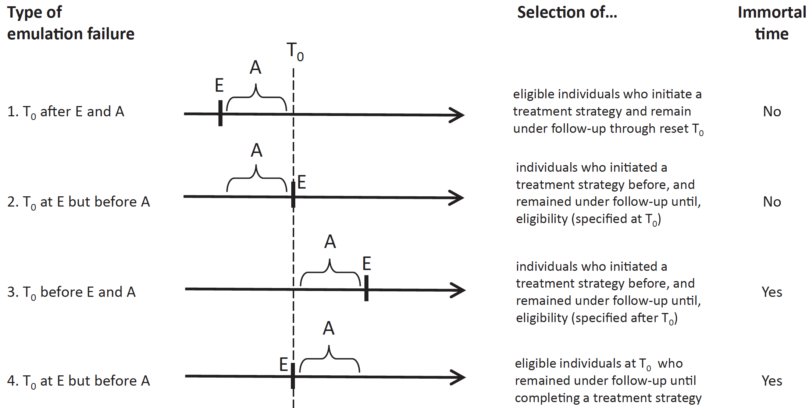
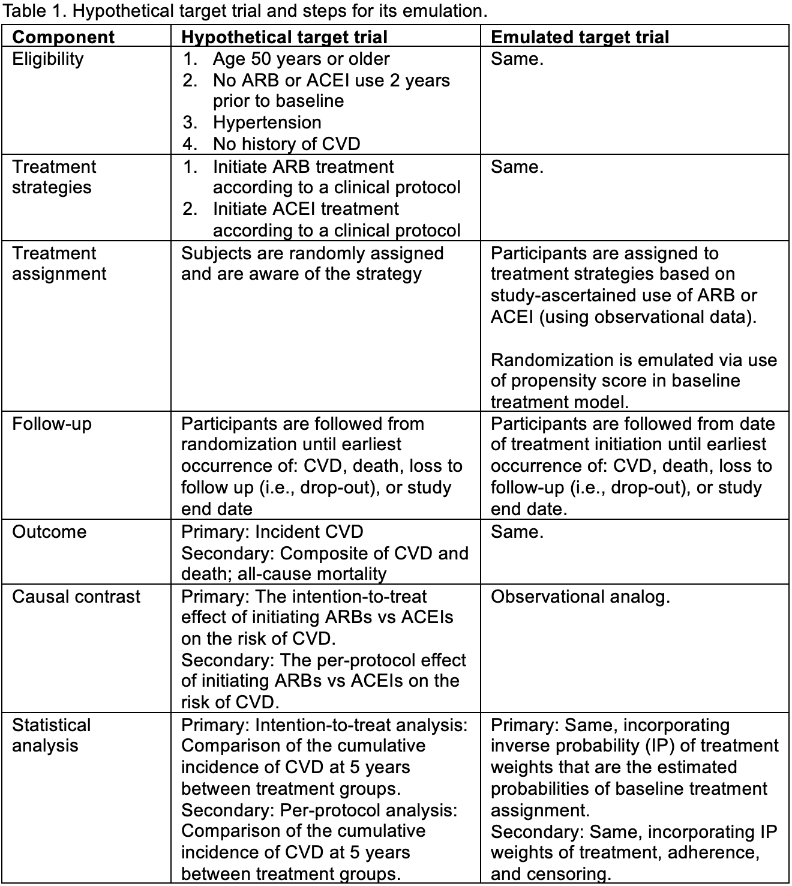

---
title: "Target Trial Emulation"
author: "Kevin Ying, Peirong Hao, Yizhe Xu*"
date: "`r Sys.Date()`"
output: rmarkdown::html_vignette
bibliography: reference_ITT.bib  
link-citations: yes
objective: To apply the target trial emulation framework to create an analysis-ready data set
vignette: >
  %\VignetteIndexEntry{Target Trial Emulation}
  %\VignetteEngine{knitr::rmarkdown}
  %\VignetteEncoding{UTF-8}
---

```{r}
knitr::opts_chunk$set(
  collapse = TRUE,
  comment = "#>"
)
options(warn = -1)
```

```{r setup, include=FALSE}
working_dir <- getwd()
knitr::opts_knit$set(root.dir = working_dir)
```

# Introduction
Randomized controlled trials (RCTs) are the gold standard for evaluating medical interventions, but they are often impractical, slow, or costly. Modern causal inference methods, coupled with real-world data (RWD), provide a faster, well-powered approach to estimating treatment effects in diverse patient populations. Yet several barriers hinder their effective use in translational research. A key challenge is aligning "time zero," the moment the cohort is defined, eligibility is assessed, and treatment strategies are assigned, which leads to intractable bias. <br>

Target trial emulation (TTE) addresses these barriers by emulating RCT protocols with observational data, e.g., electronic health records (EHRs) [@Hernn2016; @Hernan2022-sp]. The TTE framework has proven especially useful in improving communication between statisticians and clinicians and better integrate clinical insight with sound study design and incisive data analysis to enhance the quality of research. High-quality observational studies built on TTE can complement findings from RCTs and provide actionable evidence [@Wang2023]. <br>

This vignette shows how to build a fit-for-purpose dataset that minimizes bias. We briefly review the five key components of the TTE framework and explain why clear definitions for each are essential.   

## Eligibility Criteria
- Both inclusion and exclusion criteria need to be defined using **only information prior to or at baseline** 
- Eligibility criteria that use post-baseline information induce **selection bias**
- Not all trials of interest can be emulated using observational data. TTE is only feasible when the observational data contains all the information needed to apply the pre-defined eligibility criteria

## Treatment Strategies 
- Observational data is best used to emulate **a pragmatic trial** in the sense that 
  - Open-label design: patients are aware of the treatment they are prescribed
  - Treatment are compared under the usual conditions used 
  - Cannot compare new treatment due to lack of data
- New user design is highly recommended to avoid **prevalent user bias**
  - Treatment of interest: Hormone therapy versus no treatment [@Hernn2016]
  - Given that hormone therapy may cause a short-term increase in the risk of coronary heart disease (CHD), current users are likely to be CHD free
  - Including current users in the study cohort may introduce bias since patients who initiated hormone therapy then switched due to side effects are not included
  - Prevalent user bias is a type of selection bias 
- Benefits of using active control 
  - Treatment of interest:  ACEI versus ARB 
  - Both medications are first-line antihypertensive medications that are prescribed interchangeably by physicians
  - Thus, patients in these two treatment groups are much more similar, which leads to smaller confounding by indication bias before any adjustment. We refer to this situation as **pseudo-randomization**
  - In contrast, in the example of hormone therapy versus no treatment, patients who use hormone therapy can be very different than those do not use the therapy in terms of socioeconomic status and body mass index

## Assignment Procedures
- It is infeasible to emulation trials with blind assignment as individuals are aware of the treatment they received in observational data
- To mimic the randomized treatment assignment in RCTs, we restore comparability between treatment groups within strata defined by baseline covariates, and we refer to this as **conditional exchangeability**
- To achieve conditional exchangeability, we need to adjust for all confounding covariates using causal inference methods (see [@Hernan2020] for more etails)

## Outcome Identification and Validation 
- Outcomes can be identified using International Classification of Disease (ICD) codes (Version 9 or 10), medication use, or natural language processing of clinical notes 
- It is challenging to conduct blind outcome ascertainment in observational data since healthcare providers are often aware of the treatment
a patient received
  - Death outcome is an exception as it can be independently ascertained by death registry

## Time Zero
- <span style="color:red">This is the most important component in TTE</span> 
- Time zero is the start of follow-up, also referred to as baseline 
- In RCTs, the time of treatment assignment (A), the time of meeting eligibility criteria (E), and the start of follow-up ($T_0$) are typically well aligned. This alignment helps to reduce **selection bias** and **immortal time bias** significantly
- Check out the four classic emulation failure modes below [@Hernan2016]
  {width=95%}


# Implementation of TTE framework
Suppose we are interested in comparing the effectiveness of ARB versus ACEI anti-hypertensive medications on reducing the risk of cardiovascular disease (CVD). <br>

The first step of any study is to **clearly define the research questions of interest**. In our case, they are:

- Primary: What is the effect of initiating ARBs versus ACEIs on CVD risk?
- Secondary: What is the effect of initiating and continuously using ARBs versus ACEIs on CVD risk?

Vaguely defined questions are troublesome as they impact the study design, data preparation, and analysis methods used to answer these questions, leading to biased and misleading findings. <br>

With clearly defined questions, the next key step is to **build a data set that fits the purpose of the study**, i.e., a data set can be used to answer these questions with minimal bias. It is a false believe that one data set can be used to answer any questions. To build a fit-for-purpose dataset, we demonstrate two approaches to implementing TTE framework with observational data: 

- Manual coding 
- Using the TrialEmulation R package [@Danaei2013]

Before we begin, we first create a simulated data set to serve as our observational data. Using simulated data offers key advantages: it avoids data security concerns and allows us to know the true treatment effects, enabling us to evaluate the performance of different analytic strategies, including TTE and causal inference methods. <br>

We developed the function below to simulate an observational dataset representing a cohort of patients with hypertension. The patients are followed over time to compare the risk of incident cardiovascular disease under ACEI or ARB medications. The dataset includes baseline covariates, treatment assignments, and outcomes of interest. For detailed descriptions of the data-generating mechanism and parameter settings, please refer to ???.

?? Move these to a separate script
- Input Parameters: 
  - n: Number of patients
  - J: Number of follow-up time points (in years)
  - beta0.trt0: Intercept for initial treatment assignment
  - beta.adherence: Coefficient for treatment adherence
  - beta0.outcome: Intercept for outcome model
  - beta.trt.effect: Effect of treatment on outcome
  - beta0.censoring: Intercept for censoring model

```{r echo = F}
library(dplyr)

generate.obs.data <- function(n, J, beta0.trt0, beta.adherence, beta0.outcome, beta.trt.effect, beta0.censoring) {

  # Create baseline data
  baseline <- data.frame(
    id = 1:n, 
    X1_0 = rbinom(n, 1, 0.5), 
    X2_0 = rnorm(n, 0, 1), 
    age_0 = rnorm(n, 35, 12),
    X3 = rbinom(n, 1, 0.5),
    X4 = rnorm(n, 0, 1)) %>% 
    rowwise() %>%
    mutate(logit_pi0 = beta0.trt0 + 0.5 * X1_0 + 0.5 * X2_0 - 0.2 * X3 + X4 - 0.03 * age_0,
           A0 = rbinom(1, 1, plogis(logit_pi0))) %>%
    select(-logit_pi0) %>% 
    ungroup()
  
  # Expand baseline data to long format
  long_data <- baseline %>%
    slice(rep(1:n(), each = J)) %>% 
    mutate(time = rep(0:(J - 1), times = n)) %>% # Add a follow-up time variable for each patient
    group_by(id) %>%
    mutate(
      age = age_0 + time, 
      age_s = (age - 35) / 12, # Standardized age
      A_prev = NA,
      Y_prev = NA,
      C_prev = NA,
      A=if_else(time == 0, A0, NA),
      Y = if_else(time == 0, 0, NA),
      C = if_else(time == 0, 0, NA),
      eligible = 1,
      X1 = if_else(time == 0, X1_0, NA),
      X2 = if_else(time == 0, X2_0, NA)) %>%
    ungroup()
  
  # Simulate time-varying covariates, treatment, outcome, censoring, and eligibility
  long_data <- long_data %>%
    group_by(id) %>%
    group_modify(~ {
      df <- .x # Refer to the subset of rows for one patient
      for (j in 2:nrow(df)) {
        
        df$X1[j] <- rbinom(1, 1, plogis(-df$A[j - 1])) # plogis(-0) = 0.5, plogis(-1) = 0.2689414
        df$X2[j] <- rnorm(1, mean = -0.3 * df$A[j - 1], sd = 1) 
        df$A_prev[j] <- df$A[j - 1]
        df$Y_prev[j] <- df$Y[j - 1]
        df$C_prev[j] <- df$C[j - 1]
        
        # ?? Treatment or treatment adherence: 
        # The probability of adhering to treatment A at time j is a function of treatment adherence at time j-1 and covariates at time j
        logit_pi <- beta.adherence* (df$A_prev[j]-0.5 ) + 0.5 * df$X1[j] + 0.5 * df$X2[j] - 0.2 * df$X3[j] + df$X4[j] - 0.3 * df$age_s[j]
        df$A[j] <- rbinom(1, 1, plogis(logit_pi)) 
      
        # Eligibility criteria: at least 18 years old, have not received treatment, and have not experienced the event of interest
        df$eligible[j] <- as.integer(df$age[j] >= 18 & all(df$A[1:j - 1] == 0) & all(df$Y[1:j - 1] == 0))
        
        # Outcome
        if (df$Y_prev[j] == 0) {
          logit_lambda <- beta0.outcome + beta.trt.effect * df$A[j] + 0.5 * df$X1[j] + 0.5 * df$X2[j] + df$X3[j] + df$X4[j] + 0.5 * df$age_s[j]
          df$Y[j] <- rbinom(1, 1, plogis(logit_lambda))
        } else {
          df$Y[j] <- 1  # once outcome is positive, remain positive
        }
        
        # Censoring
        if (df$C_prev[j] == 0){
          logit_q <- beta0.censoring - df$A_prev[j] - 0.5 * df$X1[j] + 0.5 * df$X2[j] - 0.2 * df$X3[j] + 0.2 * df$X4[j] - df$age_s[j]
          df$C[j] <- rbinom(1, 1, plogis(logit_q))
        } else {
          df$C[j] <- 1  # once censored, remain censored
        }
      }
      df
    }) %>%
    ungroup()
  
  # Drop data after censoring or event
  t0 <- long_data %>%
    filter(C==1 | Y==1) %>%
    group_by(id) %>%
    summarise(t0=min(time))
  
  long_data <- long_data %>%
    left_join(t0) %>%
    filter(is.na(t0)| time<=t0) %>%
    select(-t0)
  
  # Drop data before first eligible
  long_data <- long_data %>%
    group_by(id) %>%
    mutate(first_eligible = min(time[eligible == 1], na.rm = TRUE)) %>%
    filter(time >= first_eligible) %>%
    ungroup() %>%
    select(-first_eligible)
  
  # Ensure all variables are numeric
  long_data <- long_data %>%
    mutate(across(c(id, time, A, Y, C, eligible, X1, X2, X3, X4, age_s), as.numeric))
  
  long_data
}

# Set seed for reproducibility
set.seed(412)
simdata0 <- generate.obs.data(n=1000, J=20, beta0.trt0=1, beta.adherence=2, 
                              beta0.outcome=-5, beta.trt.effect=-1.2, beta0.censoring=-1)
obsdata <- simdata0 %>%
  select(id, time, X1, X2, X3, X4, age, A, Y, C, age_s) 
```

## Write your own code to implement TTE
**Table 1** shows the protocol of the target trial that I wish to run and my emulating plan with observational data side by side 

{width=95%}

First, we apply the eligibility criteria in the target trial (Table 1) to our observational data by creating a "eligible" indicator
```{r}
obsdata1 <- obsdata %>%
  group_by(id) %>%
  mutate(eligible = as.integer(age >= 50 & cumsum(Y) == 0 & (lag(A)+lag(A,2)) == 0)) %>% 
  # lag(A) and lag(A, 2) shows the treatment at one and two years ago, respectively.
  ungroup()
```

?? Simplify this to active comparator set up. 
Let us see when Subject 2 becomes eligible: 
- Subject 2 is not eligible from time 0 to 6 due to age below 50, and not eligible from time 7 to 9 due to the use of ARBs in previous 2 years. Subject 2 becomes eligible at time 10.
```{r}
obsdata1 %>% filter(id==2)
```

Now, we identify the subjects who are ever eligible and the first time of becoming eligible
The first time of becoming eligible is the time zero
```{r}
eligible_info <- obsdata1 %>%
  group_by(id) %>%
  summarise(
    ever_eligible = any(eligible == 1, na.rm = TRUE),
    first_eligible_time = if (any(eligible == 1, na.rm = TRUE)) min(time[eligible == 1]) else NA_real_) %>%
  ungroup()
```

How many ever eligible? 
```{r}
table(eligible_info$ever_eligible)
```

Check a few of them: Subject 2 is first eligible at time 10 and Subjects 1 and 3 are never eligible. 
```{r}
eligible_info %>% filter(id %in% 1:3)
```

Filter out ineligible subjects
```{r}
obsdata2 <- obsdata1 %>%
  left_join(eligible_info, by = "id") # merge the eligibility information to our observational data

obsdata3 <- obsdata2 %>%
  filter(time >= first_eligible_time) %>% # include only eligible subjects
  select(-ever_eligible)
```

Create the follow-up time variable for the study using the time zero defined above
```{r}
obsdata4 <- obsdata3 %>%
  mutate(follow_up = time - first_eligible_time) %>% # 
  select(-first_eligible_time, -eligible) 
```

Build the final data set 
```{r}
# Extract baseline data 
baseline <- obsdata4 %>%
  filter(follow_up==0) %>%
  select(id, A, X1, X2, X3, X4, age) %>%
  rename(assigned_treatment = A, X1_0 = X1, X2_0 = X2, X3_0 = X3, X4_0 = X4, age_0 = age) 

# Merge baseline data to longitudinal data
obsdata5 <- obsdata4 %>%
  left_join(baseline, by = "id") %>%
  arrange(id, follow_up)

obsdata5 %>% slice_head(n=10)
```


## Use TrialEmulation R package
Another option is to use every time they are eligible (reference).  
The function data_preparation() in the R package TrialEmulation can handle this option. But in order to demonstrate what is done, we use our own code to prepare the data step by step. To make it simple, we will only enroll subjects at time 2,3 and 4. 
Trial 2
```{r}
iligible2=obsdata2 %>%
  filter(eligible == 1 & time ==2) %>%
  select(id,A, X1, X2, X3,X4,age) %>%rename(assigned_treatment=A, X1_0=X1,X2_0=X2, X3_0=X3, X4_0=X4, age_0=age )%>%
  mutate(trial = 2)
trial.2=obsdata2 %>%
  filter(id %in% iligible2$id & time >= 2) %>%
  mutate(trial = 2, follow_up = time - 2) %>%
  select(-first_eligible_time, -eligible, -ever_eligible)%>%left_join(iligible2)
```
Trial 3
```{r}
iligible3=obsdata2 %>%
  filter(eligible == 1 & time ==3) %>%
  select(id,A, X1, X2, X3,X4,age) %>%rename(assigned_treatment=A, X1_0=X1,X2_0=X2, X3_0=X3, X4_0=X4, age_0=age )%>%
  mutate(trial = 3)
trial.3=obsdata2 %>%
  filter(id %in% iligible3$id & time >= 3) %>%
  mutate(trial = 3, follow_up = time - 3) %>%
  select(-first_eligible_time, -eligible, -ever_eligible)%>%left_join(iligible3)
```
Trial 4
```{r}
iligible4=obsdata2 %>%
  filter(eligible == 1 & time ==4) %>%
  select(id,A, X1, X2, X3,X4,age) %>%rename(assigned_treatment=A, X1_0=X1,X2_0=X2, X3_0=X3, X4_0=X4, age_0=age )%>%
  mutate(trial = 4)
trial.4=obsdata2 %>%
  filter(id %in% iligible4$id & time >= 4) %>%
  mutate(trial = 4, follow_up = time - 4) %>%
  select(-first_eligible_time, -eligible, -ever_eligible)%>%left_join(iligible4)
```
Combine the trials together, we get a data set for ITT analysis of sequential trials. 
```{r}
obsdata2.all.trials <- bind_rows(trial.2, trial.3, trial.4)
```
Rename the variables to make it have the same variable names as the data prepared by the package.
```{r}
obsdata2.all.trials=obsdata2.all.trials%>%
  rename(
    trial_period = trial,
    followup_time = follow_up,
    treatment = A,
    outcome = Y,
    censoring = C,
    age = age
  )%>%arrange(trial_period,id,  followup_time)
```
Now use the R package TrialEmulation to prepare the data for ITT analysis.
```{r}
library(TrialEmulation)
prep_ITT_data <- data_preparation(
  data = obsdata2,
  id = "id", period = "time", treatment = "A",
  outcome = "Y", eligible = "eligible", # Exclude data before a patient becomes eligible
  estimand_type = "ITT",
  outcome_cov = ~ X1 + X2 + X3 + X4 + age,
  model_var = "assigned_treatment",
  use_censor_weights = F, 
  first_period = 2,
  last_period = 4,
  quiet = TRUE,control = list(maxit = 100))
dt=prep_ITT_data$data
dt=data.frame(dt)
dt=dt%>%rename(X1_0=X1,X2_0=X2, X3_0=X3, X4_0=X4, age_0=age )%>%
  arrange(trial_period,id,  followup_time)
```
Below we compare the data sets prepared by the two ways.
```{r}
table(dt$trial_period==obsdata2.all.trials$trial_period)
table(dt$id==obsdata2.all.trials$id)
table(dt$followup_time==obsdata2.all.trials$followup_time)
table(dt$treatment==obsdata2.all.trials$treatment)
table(dt$outcome==obsdata2.all.trials$outcome)
table(dt$age_0==obsdata2.all.trials$age_0)
table(dt$X1_0==obsdata2.all.trials$X1_0)
table(dt$X2_0==obsdata2.all.trials$X2_0)
table(dt$X3_0==obsdata2.all.trials$X3_0)
table(dt$X4_0==obsdata2.all.trials$X4_0)
```
We see that all are TRUE, so the two data sets are the same.
Now we can use the data for analysis.


With the simulated data ready, now we transfer the data to a form ready for different analysis. 

```{r}
#working_dir <- getwd()
trial_files <- list.files(path = working_dir, pattern = "^trial_.*\\.csv$", full.names = TRUE)
if (length(trial_files) > 0) {
  file.remove(trial_files)
}

prep_ITT_data <- data_preparation(
   data = obsdata2,
   id = "id", period = "time", treatment = "A",
   outcome = "Y", eligible = "eligible",
   estimand_type = "ITT",
    outcome_cov = ~ X1 + X2 + X3 + X4 + age_s,
    model_var = "assigned_treatment",
    use_censor_weights = TRUE, cense = "C",
    cense_d_cov = ~ X1 + X2 + X3 + X4 + age_s,
    cense_n_cov = ~ X3 + X4,
    pool_cense = "numerator",
    data_dir = working_dir, save_weight_models = TRUE,
    glm_function = "parglm", nthreads = 4, method = "FAST",
    quiet = TRUE)

```
Let's take a look on the data generated.
```{r}
dt=prep_ITT_data$data
dt%>%filter(id==2)
```
Besides the expended data for a sequence of trials, a censoring weight is also created. Let's check how the weighting models were fitted
```{r}
model_cens_pool_n=prep_ITT_data$censor_models$cens_pool_n # Pooled numerator model for censoring
# Denominator models for different treatment arms:
model_cens_d0=prep_ITT_data$censor_models$cens_d0
model_cens_d1=prep_ITT_data$censor_models$cens_d1
obsdata5=obsdata5%>%mutate(C_neg=1-C) # Not censored???
fit.pooled.n=glm(C_neg~X3+X4, data=obsdata5, family = "binomial")
fit.pooled.n
model_cens_pool_n
#fit.pooled.n and model_cens_pool_n are the same

obsdata5=obsdata5%>%group_by(id) %>%mutate(prev_A=lag(A, default=0)) %>%
  ungroup() 
fit.d0=glm(C_neg~X1+X2+X3+X4+age_s, data=obsdata5%>%filter(prev_A==0), family = "binomial")
fit.d0
model_cens_d0
fit.d1=glm(C_neg~X1+X2+X3+X4+age_s, data=obsdata5%>%filter(prev_A==1), family = "binomial")
fit.d1
model_cens_d1

```
So we can see the way that the weighting models are fitted is the same as what we did above.
The data is ready for the analysis. We can fit a marginal structure model (MSM).
```{r}
library("splines")
ITT_result <- trial_msm(prep_ITT_data$data,
 estimand_type = "ITT",
 outcome_cov = ~ X1 + X2 + X3 + X4 + age_s,
 model_var = "assigned_treatment",
 include_followup_time = ~ ns(followup_time, df = 3),
 glm_function = "glm",
 use_sample_weights = FALSE,
 quiet = TRUE)
ITT_result 
```

 

# Case II: A new-user, active comparator design; Per-protocol analysis
Explain PP here. 
For per-protocol analysis, we need to prepare a data in the person-time long format. Each subject has multiple rows and each row  should include the following variables:  id patient identifier
 month time period
  treatment indicator for receiving treatment in this period, 1=treatment, 0=non-treatment
  time-varying  variables relating to treatment and the outcome
  time-invariant variables relating to treatment and the outcome
  event indicator 
  LTFU censoring indicator
Below we will illustrate how to create the data set for per-protocol analysis using some variables from the observed data we simulated. 
```{r}
# Prepare data for per-protocol analysis by adjusting for treatment switching and censoring
# Fit models for both treatment switching (numerator and denominator) and censoring (numerator and denominator).
prep_PP_data <- data_preparation(
 data = obsdata2,
 id = "id", period = "time", treatment = "A",
 outcome = "Y", eligible = "eligible",
 estimand_type = "PP",
 outcome_cov = ~ X1 + X2 + X3 + X4 + age_s,
 model_var = "assigned_treatment",
 switch_d_cov = ~ X1 + X2 + X3 + X4 + age_s
 + time_on_regime + I(time_on_regime^2),
 switch_n_cov = ~ X3 + X4 + time_on_regime + I(time_on_regime^2),
 use_censor_weights = TRUE, cense = "C",
 cense_d_cov = ~ X1 + X2 + X3 + X4 + age_s,
 cense_n_cov = ~ X3 + X4,
 pool_cense = "numerator",,
 data_dir = working_dir, save_weight_models = TRUE,
 chunk_size = 500, separate_files = TRUE,
 quiet = TRUE)
adh.model.d0=prep_PP_data$switch_models$switch_d0
adh.model.d1=prep_PP_data$switch_models$switch_d1
adh.model.n0=prep_PP_data$switch_models$switch_n0
adh.model.n1=prep_PP_data$switch_models$switch_n1
cens.model.d0=prep_PP_data$censor_models$cens_d0
cens.model.d1=prep_PP_data$censor_models$cens_d1
cens.model.n=prep_PP_data$censor_models$cens_pool_n

```
Check how these models are fitted
```{r}
#model.pp.cens.n=readRDS("/Users/kevinying/TTEvignette/cense_model_d0.rds")
model.pp.cens.n=readRDS(file.path(working_dir, "cense_model_pool_n.rds"))
dt.pp.cens.n=model.pp.cens.n$data
check.cens.n=obsdata5%>%left_join(dt.pp.cens.n%>%mutate(flag=1,time=period)%>%select(id,time,flag))
check.cens.n%>%filter(id==6)
obsdata2%>%filter(id==6)

#model.pp.cens.d0=readRDS("/Users/kevinying/TTEvignette/cense_model_d0.rds")
model.pp.cens.d0=readRDS(file.path(working_dir, "cense_model_d0.rds"))
dt.pp.cens.d0=model.pp.cens.d0$data
check.cens.d0=obsdata5%>%left_join(dt.pp.cens.d0%>%mutate(flag=1,time=period)%>%select(id,time,flag))
check.cens.d0%>%filter(id==6)
obsdata2%>%filter(id==6)

#model.pp.cens.d1=readRDS("/Users/kevinying/TTEvignette/cense_model_d1.rds")
model.pp.cens.d1=readRDS(file.path(working_dir, "cense_model_d1.rds"))
dt.pp.cens.d1=model.pp.cens.d1$data
check.cens.d1=obsdata5%>%left_join(dt.pp.cens.d1%>%mutate(flag=1,time=period)%>%select(id,time,flag))
check.cens.d1%>%filter(id==6)
obsdata2%>%filter(id==6)

prep_PP_data$switch_models$switch_n0
#model.pp.switch.n0=readRDS("/Users/kevinying/TTEvignette/weight_model_switch_d0.rds")
model.pp.switch.n0=readRDS(file.path(working_dir, "weight_model_switch_n0.rds"))
dt.pp.switch.n0=model.pp.switch.n0$data
check.switch.n0=obsdata5%>%left_join(dt.pp.switch.n0%>%mutate(flag=1,time=period)%>%select(id,time,flag))
check.switch.n0%>%filter(id==6)
obsdata2%>%filter(id==6)

prep_PP_data$switch_models$switch_n1
#model.pp.switch.n1=readRDS("/Users/kevinying/TTEvignette/weight_model_switch_d1.rds")
model.pp.switch.n1=readRDS(file.path(working_dir, "weight_model_switch_n1.rds"))
dt.pp.switch.n1=model.pp.switch.n1$data
check.switch.n1=obsdata5%>%left_join(dt.pp.switch.n1%>%mutate(flag=1,time=period)%>%select(id,time,flag))
check.switch.n1%>%filter(id==6)
obsdata2%>%filter(id==6)

prep_PP_data$switch_models$switch_d0
#model.pp.switch.d0=readRDS("/Users/kevinying/TTEvignette/weight_model_switch_d0.rds")
model.pp.switch.d0=readRDS(file.path(working_dir, "weight_model_switch_d0.rds")) 
dt.pp.switch.d0=model.pp.switch.d0$data
check.switch.d0=obsdata5%>%left_join(dt.pp.switch.d0%>%mutate(flag=1,time=period)%>%select(id,time,flag))
check.switch.d0%>%filter(id==6)
obsdata2%>%filter(id==6)

prep_PP_data$switch_models$switch_d1
#model.pp.switch.d1=readRDS("/Users/kevinying/TTEvignette/weight_model_switch_d1.rds")
model.pp.switch.d1=readRDS(file.path(working_dir, "weight_model_switch_d1.rds"))
dt.pp.switch.d1=model.pp.switch.d1$data
check.switch.d1=obsdata5%>%left_join(dt.pp.switch.d1%>%mutate(flag=1,time=period)%>%select(id,time,flag))
check.switch.d1%>%filter(id==6)
obsdata2%>%filter(id==6)
```

```{r}

dt.pp=NULL
for (i in 1:length(prep_PP_data$data)) {
  tmp <- read.csv(file.path(prep_PP_data$data[i]))
  dt.pp <- rbind(dt.pp, tmp)
}

dt.pp=dt.pp%>%mutate(time=trial_period+followup_time)%>%arrange(id,time)
ck=dt.pp[!duplicated(dt.pp%>%select(id,time)),]

data_censored_simp_PP <- obsdata5 %>%
  mutate(time = time + 1) %>%
  dplyr::rename(month = time, event = Y, LTFU = C, treatment=A, prev_treatment=prev_A) %>%
  dplyr::select( id, month,assigned_treatment, treatment,prev_treatment, X1,X2,X3,X4,age_s,event,LTFU) 

# Extract each individual’s initial treatment
tmp <- data_censored_simp_PP %>%
  group_by(id) %>%
  filter(row_number()==1) %>%
  rename(tx0 = treatment) %>%
  select(id, tx0)
  
data_censored_simp_PP2 <- data_censored_simp_PP %>% left_join(tmp, by = "id")
data_censored_simp_PP3 <- data_censored_simp_PP2 %>%group_by(id)%>%
  mutate(adherence = ifelse(treatment == tx0, 1, 0),
         time_on_regime = cumsum(adherence)-1) # Minus 1 because baseline does not count
data_censored_simp_PP4 <- data_censored_simp_PP3 %>%
  mutate(art_censored = 1-adherence)  # Patients deviate from treatment assignment
time.switch=  data_censored_simp_PP4 %>%filter(art_censored==1)%>%group_by(id)%>%
  summarise(t.switch=min(month))%>%ungroup() # First time they deviate

if (length(trial_files) > 0) {
  file.remove(trial_files)
}

data_censored_simp_PP5  <- data_censored_simp_PP4 %>% left_join(time.switch, by = "id") 
 data_censored_simp_PP6=data_censored_simp_PP5%>% filter(month<=t.switch | is.na(t.switch)) # Keep the rows before deviating or no switch

# Predict treatment adherence for those not treated in the previous period and assigned to control
fit.adh.d0=glm(treatment~X1+X2+X3+X4+age_s, data=data_censored_simp_PP5%>%filter(prev_treatment==0 & assigned_treatment==0), family = "binomial")
fit.adh.d0
```

Now we create treatment adherence variable which is defined as adhering to initial treatment every month and no contraindication is allowed, i.e. once a subject deviates from the protocol, they are considered non-adherent for the rest of the follow-up. We first create a variable that indicates the initial treatment assignment at baseline. Then we create an adherence variable that indicates if the subject is adhering to the initial treatment assignment every month.

```{r}
tmp <- data_censored_simp_PP %>%
  group_by(id) %>%
  filter(row_number()==1) %>%
  rename(tx0 = treatment) %>%
  select(id, tx0)
  
data_censored_simp_PP2 <- data_censored_simp_PP %>% left_join(tmp, by = "id")
data_censored_simp_PP3 <- data_censored_simp_PP2 %>%
  mutate(adherence = ifelse(treatment == tx0, 1, 0))
View(data_censored_simp_PP3)
```
Next we create artificially censored variable assuming monotone censoring that is defined as follows: once a subject deviates from the protocol, they are considered artificially censored. Finally, we remove the rows of data after deviating from the protocol. But we keep the row of being artificially censored for estimating the adherence probabilities.
# remove the rows of data after deviating from the protocol
```{r}
data_censored_simp_PP4 <- data_censored_simp_PP3 %>%
  mutate(art_censored = 1-adherence)
  
data_censored_simp_PP5  <- data_censored_simp_PP4 %>% 
  group_by(id) %>% 
  mutate(cum_art_censored = cumsum(art_censored)) %>% 
  filter(cum_art_censored %in% c(0,1)) %>% # We keep the row of being artificially censored for estimating the adherence probabilities 
  select(-cum_art_censored)

View(data_censored_simp_PP5)
```
This data is ready for per-protocol analysis.

Below we demostrate how to use the data_preparation() function in the TrialEmulation R package to create the analysis-ready data set for ITT analysis. data_preparation() function is a wrapper function that prepares the data for target trial emulation. It takes the data in person-time long format format and returns the data in person-trial-time long format that is ready for “sequential trials” analysis described by Hernan (ref).  The function also estimates the treatment and censoring weights for the analysis.

# Case III: A new-user, placebo control design; Intention-to-treat analysis (TrialEmulation)
We first try a simple case where censoring is assumed as random. We specify the estimand type as "ITT" and we specify the outcome covariates that are used to adjust for cofounding. The outcome covariates are the baseline covariates that are selected based on domain knowledge and may confound the treatment-outcome relationship. Since we assume censoring is random, we do not specify the censoring model. 
```{r}
library(TrialEmulation)
data(data_censored)
View(data_censored)
data_censored_ITT <- data_preparation(data_censored, estimand_type = "ITT", outcome_cov = ~x1+x2+x3+x4+age_s)
```
Now let's check the expanded data. 
```{r}
data_censored_ITT$min_period
data_censored_ITT$max_period # A sequence of 20 trials

# total number of subjects in the expanded data 
data_censored_ITT$N

# expanded data 
data_censored_ITT_dat <- data_censored_ITT$data
View(data_censored_ITT_dat)

data_censored_ITT_dat_id2 <- data_censored_ITT_dat %>% 
  filter(id == 2) %>%
  arrange(id, trial_period, followup_time)
View(data_censored_ITT_dat_id2)

data_censored_ITT_dat_id4 <- data_censored_ITT_dat %>% 
  filter(id == 4) %>%
  arrange(id, trial_period, followup_time)
View(data_censored_ITT_dat_id4)
```
Now we assume that censoring is not random and is dependent on a list of covariates. We can direct data_preparation() to fit the censoring model and use the estimated censoring weights in the analysis. Specifically, we specify variables for the denominator model cense_d_cov and the numeric model cense_n_cov. The variables in the denominator model include baseline variables and time-varying variables. The variables in the numerator model include the baseline variables. This way, the stabilized IPW is estimated. If unstablized IPWis desired, then simply specify cense_n_cov = ~ 1.     
```{r}
data_censored_ITT2 <- data_preparation(data_censored, estimand_type = "ITT", outcome_cov = ~x1+x2+x3+x4+age_s,
                                       use_censor_weights = TRUE, cense = "censored", # censoring indicator variable in the dataset
                                       cense_d_cov = ~ x1 + x2 + x3 + x4 + age_s, # Denominator model includes both baseline and time-varying covariates.
                                       cense_n_cov = ~ x3 + x4, # Numerator model includes only baseline covariates.
                                       pool_cense = "numerator", # does not allow the numerator model to be fitted separately for the treatment groups
                                       glm_function = "parglm", nthreads = 4, method = "FAST", quiet = TRUE)

data_censored_ITT2$censor_models
```

# Case IV: A new-user, placebo control design; Per-protocol analysis
Data_preparation() can also create an analysis-ready data set for per-protocol analysis. We specify the estimand type as "PP". Besides what we specified for the ITT analysis as above, we here also need to specify the models to calculate treatment weight.  The switch_d_cov variables include baseline variables and time-varying variables. The switch_n_cov variables include the baseline variables. Both models can also include time_on_regime and its s quadratic term to account for the time-varying treatment adherence. The pool_cense argument is set to "none" to allow the numerator and denominator models to be fitted separately for the treatment groups.
```{r}
library(TrialEmulation)
data(data_censored)
View(data_censored)

# Expand data using data_preparation 
data_censored_PP <- data_preparation(data_censored, estimand_type = "PP", outcome_cov = ~x1+x2+x3+x4+age_s,
                                     # Denominator model for treatment switching: baseline + time-varying covariates + time_on_regime
                                     switch_d_cov = ~ x1 + x2 + x3 + x4 + age_s + time_on_regime + I(time_on_regime^2),
                                     switch_n_cov = ~ x3 + x4 + time_on_regime + I(time_on_regime^2),
                                     # Numerator model for treatment switching: baseline covariates + time-on-regime terms
                                     use_censor_weights = TRUE, cense = "censored", 
                                     cense_d_cov = ~ x1 + x2 + x3 + x4 + age_s, cense_n_cov = ~ x3 + x4,
                                     pool_cense = "none", # Separate censoring models for each treatment group
                                     glm_function = "parglm", nthreads = 4, method = "FAST", quiet = TRUE)
data_censored_PP$min_period
data_censored_PP$max_period # A sequence of 19 trials

# total number of subjects in the expanded data 
data_censored_PP$N  

# expanded data 
data_censored_PP_dat <- data_censored_PP$data

data_censored_PP_dat_id2 <- data_censored_PP_dat %>% 
  filter(id == 2)
View(data_censored_PP_dat_id2)

data_censored_PP_dat_id4 <- data_censored_PP_dat %>% 
  filter(id == 4) %>%
  arrange(id, trial_period, followup_time)
View(data_censored_PP_dat_id4)
```

Now let's explore the censoring and treatment models and demonstrate how they are used to create the weights. We save the weighting models in working_dir and import them to make predictions later.
```{r}
# working_dir <- "/Users/kevinying/TTEvignette"

trial_files <- list.files(path = working_dir, pattern = "^trial_.*\\.csv$", full.names = TRUE)
if (length(trial_files) > 0) {
  file.remove(trial_files)
}

data_censored_PP <- data_preparation(data_censored, estimand_type = "PP", outcome_cov = ~x1+x2+x3+x4+age_s,
                                     switch_d_cov = ~ x1 + x2 + x3 + x4 + age_s + time_on_regime + I(time_on_regime^2),
                                     switch_n_cov = ~ x3 + x4 + time_on_regime + I(time_on_regime^2),
                                     use_censor_weights = TRUE, cense = "censored", 
                                     cense_d_cov = ~ x1 + x2 + x3 + x4 + age_s, cense_n_cov = ~ x3 + x4,
                                     pool_cense = "none", 
                                     data_dir = working_dir, save_weight_models = TRUE,
                                     glm_function = "parglm", nthreads = 4, method = "FAST", quiet = TRUE)
# View(data_censored_PP$data)
# Note only baseline values of the time-varying variables are kept in the data set for downstream marginal structural models 
# The row of being artificially censored are not included 

# load the saved models 
weight_model_switch_d0 <- readRDS("weight_model_switch_d0.rds")
weight_model_switch_d1 <- readRDS("weight_model_switch_d1.rds")
weight_model_switch_n0 <- readRDS("weight_model_switch_n0.rds")
weight_model_switch_n1 <- readRDS("weight_model_switch_n1.rds")

cense_model_d0 <- readRDS("cense_model_d0.rds")
cense_model_d1 <- readRDS("cense_model_d1.rds")
cense_model_n0 <- readRDS("cense_model_n0.rds")
cense_model_n1 <- readRDS("cense_model_n1.rds")
```

Next we prepare the data set for making predictions. For simplicity, we only look at trial period zero for now. Because the weighting models include time_on_regime and its quadratic term, we need to create the time_on_regime variable. The time_on_regime variable is defined as the cumulative adherence to the assigned treatment minus one at baseline. We also create the followup_time2 variable that is used to match the data with the censoring model. The followup_time2 variable is defined as the followup_time plus trial_period.
```{r}
tmp_dat <- data_censored_PP$data %>%
  group_by(id, trial_period) %>%
  mutate(adherence = ifelse(treatment == assigned_treatment, 1, 0), # in the cleaned PP data set, this adherence = 1 everywhere
         time_on_regime = cumsum(adherence)-1,  # -1 to not account the one at baseline 
         followup_time2 = followup_time+trial_period) %>%
  select(-c(x1, x2, age_s)) %>% 
  filter(trial_period == 0)

data_censored_tmp <- data_censored %>%
  rename(followup_time2 = period) %>%
  select(id, followup_time2, x1, x2, age_s)

tmp_dat2 <- tmp_dat %>% 
  left_join(data_censored_tmp, by=c("id", "followup_time2"))%>%
  arrange(id, trial_period, followup_time)
```
Finally we make the predictions and create the weights. Since we fit separate models for control and treatment arms,we need to make the prediction seperately. 
```{r}

# for control arm
ctl_dat <- tmp_dat2 %>%
  filter(assigned_treatment == 0)

# probabilities of receiving treatment = 1 at each month 
weight_switch_d0 <- predict(weight_model_switch_d0, newdata = ctl_dat, type = "response")
weight_switch_n0 <- predict(weight_model_switch_n0, newdata = ctl_dat, type = "response")
switch_ctl <- (1-weight_switch_n0)/(1-weight_switch_d0) # 1-prob(tx = 1) = prob(tx = 0)

cense_d0 <- predict(cense_model_d0, newdata = ctl_dat, type = "response")
cense_n0 <- predict(cense_model_n0, newdata = ctl_dat, type = "response")
cense_ctl <- cense_n0/cense_d0

ctl_dat2 <- data.frame(ctl_dat, switch_ctl, cense_ctl) %>%
  group_by(id, trial_period) %>%
  mutate(prod_w = switch_ctl*cense_ctl,
         prod_w_new = case_when(followup_time == 0 ~ 1, # assuming no one is censored or non-adherent at baseline
                                TRUE ~ prod_w),
         cum_prod_w = cumprod(prod_w_new))

View(ctl_dat2[, c("id", "trial_period", "followup_time", "weight", "cum_prod_w")])


# for treatment arm 
trt_dat <- tmp_dat2 %>%
  filter(assigned_treatment == 1)

weight_switch_d1 <- predict(weight_model_switch_d1, newdata = trt_dat, type = "response")
weight_switch_n1 <- predict(weight_model_switch_n1, newdata = trt_dat, type = "response")
switch_trt <- weight_switch_n1/weight_switch_d1

cense_d1 <- predict(cense_model_d1, newdata = trt_dat, type = "response")
cense_n1 <- predict(cense_model_n1, newdata = trt_dat, type = "response")
cense_trt <- cense_n1/cense_d1

trt_dat2 <- data.frame(trt_dat, switch_trt, cense_trt) %>%
  group_by(id, trial_period) %>%
  mutate(prod_w = switch_trt*cense_trt,
         prod_w_new = case_when(followup_time == 0 ~ 1, 
                                TRUE ~ prod_w),
         cum_prod_w = cumprod(prod_w_new))

View(trt_dat2[, c("id", "trial_period", "followup_time", "weight", "cum_prod_w")])
```

# inconsistent component 
```{r}
ctl_dat3 <- data.frame(ctl_dat, switch_ctl, cense_ctl) %>%
  group_by(id, trial_period) %>%
  mutate(cense_ctl_new = case_when(followup_time == max(followup_time) ~ 1, # At the last time point, the patient is not censored, censoring weight is set to 1.
                                TRUE ~ cense_ctl),
         switch_ctl_new = case_when(followup_time == 0 ~ 1, # At the first time point, the patient has not switched, switching weight is set to 1.
                                TRUE ~ switch_ctl),
         prod_w = switch_ctl_new*cense_ctl_new,
         cum_prod_w = cumprod(prod_w))

View(ctl_dat3[, c("id", "trial_period", "followup_time","cense_ctl", "cense_ctl_new", "switch_ctl", "switch_ctl_new", "weight", "cum_prod_w")])
```

## Funding
This work was supported by Utah Clinical & Translational Science Institute (CTSI) Translational Innovation Pilot (TIP) Program Award (NCATS UM1TR004409).

## References