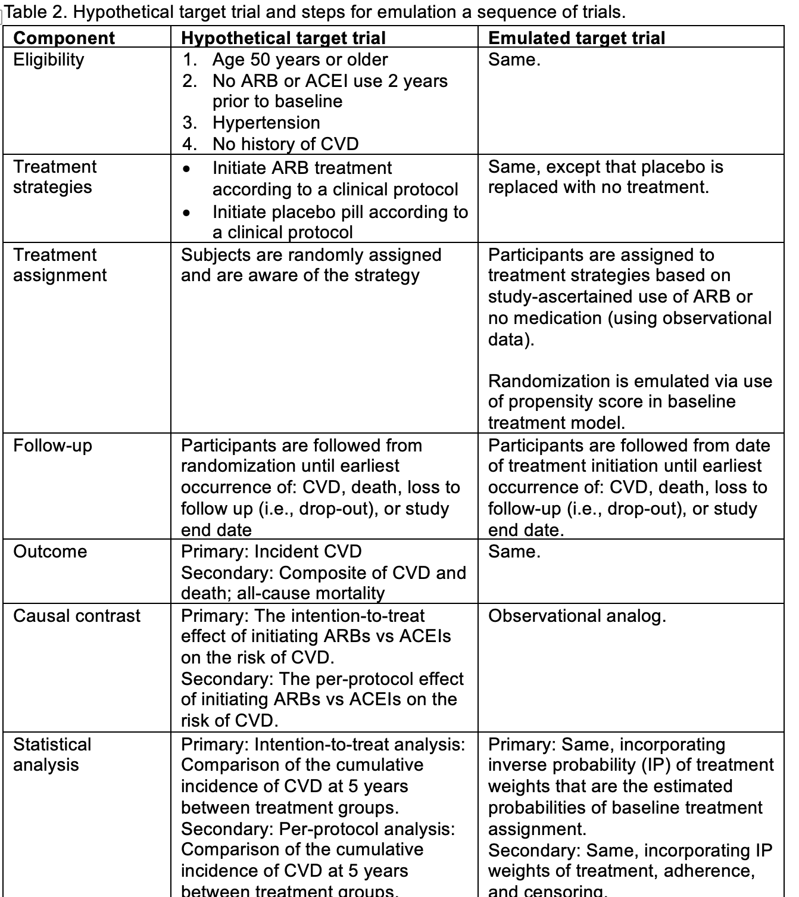
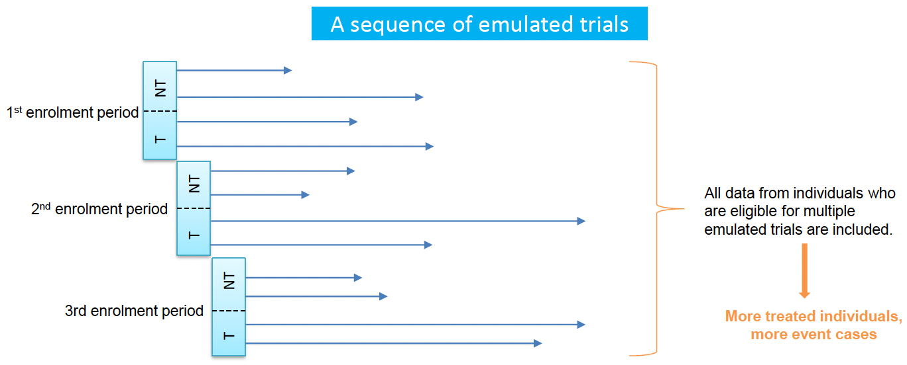

---
title: "Target Trial Emulation"
author: "Kevin Ying, Peirong Hao, Yizhe Xu*"
date: "`r Sys.Date()`"
output: rmarkdown::html_vignette
bibliography: reference_ITT.bib  
link-citations: yes
objective: To apply the target trial emulation framework to create an analysis-ready data set
vignette: >
  %\VignetteIndexEntry{Target Trial Emulation}
  %\VignetteEngine{knitr::rmarkdown}
  %\VignetteEncoding{UTF-8}
---

```{r}
knitr::opts_chunk$set(
  collapse = TRUE,
  comment = "#>"
)
options(warn = -1)
```

```{r setup, include=FALSE}
working_dir <- getwd()
knitr::opts_knit$set(root.dir = working_dir)
library(dplyr)
library(TrialEmulation)
```

We have explained how to implement TTE through manual coding for an [active-comparator study design](https://uqualitycausal.github.io/TTECausalR/TTEdemoSig.html). In this tutorial, we focus on a placebo-controlled design, where individuals in the control group may meet the eligibility criteria multiple times [@Hernn2016]. This makes it unclear how to define their time zero.

## A Placebo-control Design 
We modify the previous example to compare the effectiveness of ARB versus no anti-hypertensive medications on reducing the risk of cardiovascular disease (CVD) among subjects with hypertension with no history of chronic disease and no use of ARB medications during the previous 2 years. **Table 1** shows the protocol of the target trial that I wish to run and my emulating plan with observational data side by side.

{width=95%}


Recall the three key steps before implementing TTE: 

- **Step 1: Clearly define the research questions of interest**. In our case, they are:
  - Primary: What is the effect of initiating ARBs versus no medication on CVD risk?
  - Secondary: What is the effect of initiating and continuously using ARBs versus no medication on CVD risk?
  - *Vaguely defined questions are troublesome as they impact the study design, data preparation, and analysis methods used to answer these questions, leading to biased and misleading findings. 

- **Step 2: Clarify study design**
  - Our example uses an observational, new-user, placebo control, retrospective cohort design
  - Individuals in the control group meet these eligibility criteria in Table 1 continuously would be eligible for the target trial at multiple times during their lifetime, that is, they have multiple times that can qualify as time zero. When should their follow-up start in the observational study?
  - Two unbiased options: 
    - **All eligible times**: 
      - This option is more efficient by using all the data from each individual
      - A classic use case: Data with a small sample size or low event rate 
      - However, it requires **emulating a sequence of trials**, each with a different start of follow-up 
      - More complicated analysis procedures to account that using the same individual's data multiple times in the study
    - A random eligible time: 
      - Simple but less efficient
      - This option is appropriate when there is sufficient statistical power in a study 

- **Step 3: Build a data set that fits the purpose of the study**
  - A data set can be used to answer these questions with minimal bias
  - It is a false believe that one data set can be used to answer any questions 
  - To build a fit-for-purpose dataset, @Danaei2013 demonstrated how to emulate a sequence of trials with observational data using the _TrialEmulation_ R package 

{width=95%}

## Example data
We modified the observational dataset from the [TTE for active comparator design ](https://uqualitycausal.github.io/TTECausalR/TTEdemoSig.html) session by changing the reference treatment group to placebo control.  
```{r}
obsdata2 <- readRDS("obsdata2.rds")
attr(obsdata2$A, "label") <- "Treatment indicator of ARB use over time (placebo=0)"

get_label <- function(x) {
  lbl <- attr(x, "label", exact = TRUE)
  if (is.null(lbl)) "" else as.character(lbl)
}

dict <- data.frame(
  Variable = names(obsdata2),
  Meaning  = vapply(obsdata2, get_label, character(1)),
  check.names = FALSE
)

knitr::kable(dict, caption = "Data Dictionary", row.names = FALSE)
```


## Emulating a sequence of trials
Suppose treatment and covariates information are updated monthly in our observational data, so we consider each month as a separate enrollment period. For instance, the first enrollment period is Jan. 2017, then Feb. 2017, and so on. <br>

In contrast to emulating a single trial, we need to construct a pooled dataset by stacking the separate data from each trial. Here are a few  things to keep in mind during this process:

- Each of the multiple trials has a different baseline (time zero), so the baseline information (covariates and treatment) need to be set to the values at current time zero if they can vary over time. For instance, the baseline SBP for Trial 1 is the SBP value in Jan. 2017 but the baseline SBP for Trial 2 is the SBP value in Feb. 2017 
- The same individual could contribute data to one emulated trial as a non-initiator but as an ARB initiator in another emulated trial later since his/her treatment status changes over time
- As we move the enrollment period forward in calendar time, the follow-up time is decreasing by one month each time since the start of follow-up is one month later, so we need to adjust it across all the emulated trials accordingly
- For the reason above, it is a good practice to prespecify an overall **index window**, say 01/01/2017 - 01/01/2020, and a study period say 01/01/2017 - 01/01/2024, so that even individuals in the last emulated trial are followed up for a sufficient amount of time, i.e., 4 years
- Create an emulated trial indicator for downstream analyses where we can allow treatment effects to remain constant or vary across trials

Before start using the _TrialEmulation_ R package, it is crucial to understand the process being carried out in the _data_preparation_ function. We explain the steps using a toy example where we only consider three enrollment times: at the beginning of the overall study, month 1, and month 2.

- Create data for the 1st emulated trial
```{r}
# Select eligible individuals
iligible1 <- obsdata2 %>%
  filter(eligible == 1 & time == 0) %>%    # time zero is the original study baseline for the 1st trial
  select(id, A, X1, X2, X3, X4, age) %>%
  rename(assigned_treatment=A, X1_0=X1, X2_0=X2, X3_0=X3, X4_0=X4, age_0=age) # baseline covariates in the 1st trial are the same as the baseline covariates of the study 

trial.1 <- obsdata2 %>%
  filter(id %in% iligible1$id & time >= 0) %>%   # time zero is the original study baseline for the 1st trial
  mutate(trial = 0,   # create an emulated trial indicator
         follow_up = time) %>%  # no adjustment of follow-up time is needed since the 1st trial share the same baseline as the entire study
  select(-first_eligible_time, -eligible, -ever_eligible) %>%
  left_join(iligible1)
```

- Create data for the 2nd emulated trial
```{r}
# Select eligible individuals 
iligible2 <- obsdata2 %>%
  filter(eligible == 1 & time == 1) %>%   # time zero is time 1 for the 2nd trial
  select(id, A, X1, X2, X3, X4, age) %>%
  rename(assigned_treatment=A, X1_0=X1, X2_0=X2, X3_0=X3, X4_0=X4, age_0=age) # baseline covariates in the 2nd trial are the covariates at time 1 

trial.2 <- obsdata2 %>%
  filter(id %in% iligible2$id & time >= 1) %>% # time zero is time 1 for the 2nd trial
  mutate(trial = 1,       # create an emulated trial indicator
         follow_up = time - 1) %>%     # adjust the follow-up time by decreasing by 1
  select(-first_eligible_time, -eligible, -ever_eligible) %>%
  left_join(iligible2)
```

- Create data for the 3rd emulated trial
```{r}
# Select eligible individuals 
iligible3 <- obsdata2 %>%
  filter(eligible == 1 & time == 2) %>%    # time zero is time 2 for the 3rd trial
  select(id, A, X1, X2, X3, X4, age) %>%
  rename(assigned_treatment=A, X1_0=X1, X2_0=X2, X3_0=X3, X4_0=X4, age_0=age) # baseline covariates in the 3rd trial are the covariates at time 2 

trial.3 <- obsdata2 %>%
  filter(id %in% iligible3$id & time >= 2) %>% 
  mutate(trial = 2,       # create an emulated trial indicator
         follow_up = time - 2) %>%     # adjust the follow-up time by decreasing by 2
  select(-first_eligible_time, -eligible, -ever_eligible) %>%
  left_join(iligible3)
```

- Now, we stack all the data from three emulated trials 
```{r}
obsdata2.all.trials <- data.frame(rbind(trial.1, trial.2, trial.3)) %>%
  rename(trial_period = trial,
         followup_time = follow_up,
         treatment = A, 
         outcome = Y)
head(obsdata2.all.trials, n=10)
```


## Use TrialEmulation R package
We now use the [data_preparation function](https://cran.r-project.org/web/packages/TrialEmulation/TrialEmulation.pdf) to prepare the data for emulating a sequence of trials and focus on the primary intention-to-treat estimand.
```{r}
prep_ITT_data <- data_preparation(
  data = obsdata2,
  id = "id", 
  period = "time", 
  treatment = "A",
  outcome = "Y", 
  eligible = "eligible",  # indicator of eligibility for the target trial at that visit/period
  estimand_type = "ITT",
  outcome_cov = ~ X1 + X2 + X3 + X4 + age,
  model_var = "assigned_treatment",
  use_censor_weights = F, 
  first_period = 0,
  last_period = 2,
  quiet = TRUE,
  control = list(maxit = 100))

dt <- data.frame(prep_ITT_data$data)
dt <- dt %>% 
  rename(X1_0=X1, X2_0=X2, X3_0=X3, X4_0=X4, age_0=age) %>%
  arrange(trial_period, id, followup_time)
```


Let us compare the data sets prepared on our own and using the _data_preparation_ function
```{r}
table(dt$trial_period==obsdata2.all.trials$trial_period)
table(dt$id==obsdata2.all.trials$id)
table(dt$followup_time==obsdata2.all.trials$followup_time)
table(dt$treatment==obsdata2.all.trials$treatment)
table(dt$outcome==obsdata2.all.trials$outcome)
table(dt$age_0==obsdata2.all.trials$age_0)
table(dt$X1_0==obsdata2.all.trials$X1_0)
table(dt$X2_0==obsdata2.all.trials$X2_0)
table(dt$X3_0==obsdata2.all.trials$X3_0)
table(dt$X4_0==obsdata2.all.trials$X4_0)
```
It shows that all the variable are the same between the two data sets though finer checking can be made. Both datasets are ready to be used for downstream analyses now.


## Funding
This work was supported by Utah Clinical & Translational Science Institute (CTSI) Translational Innovation Pilot (TIP) Program Award (NCATS UM1TR004409).

## References